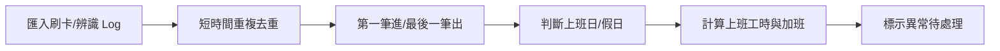
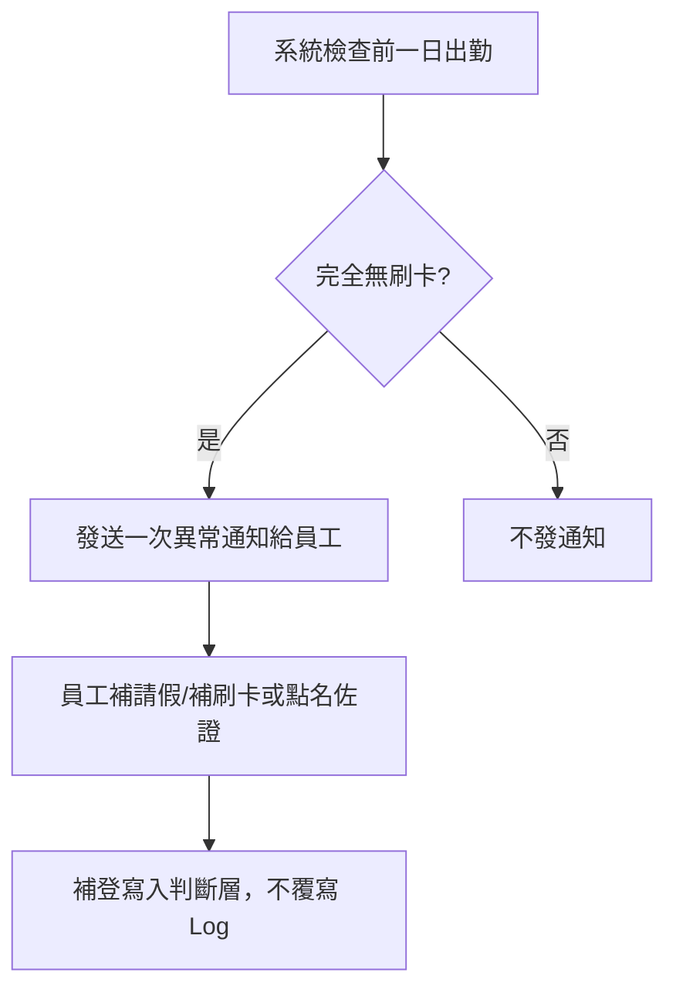
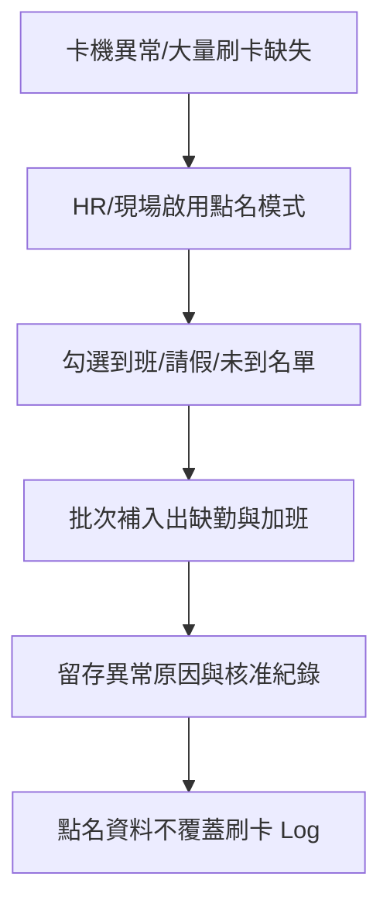
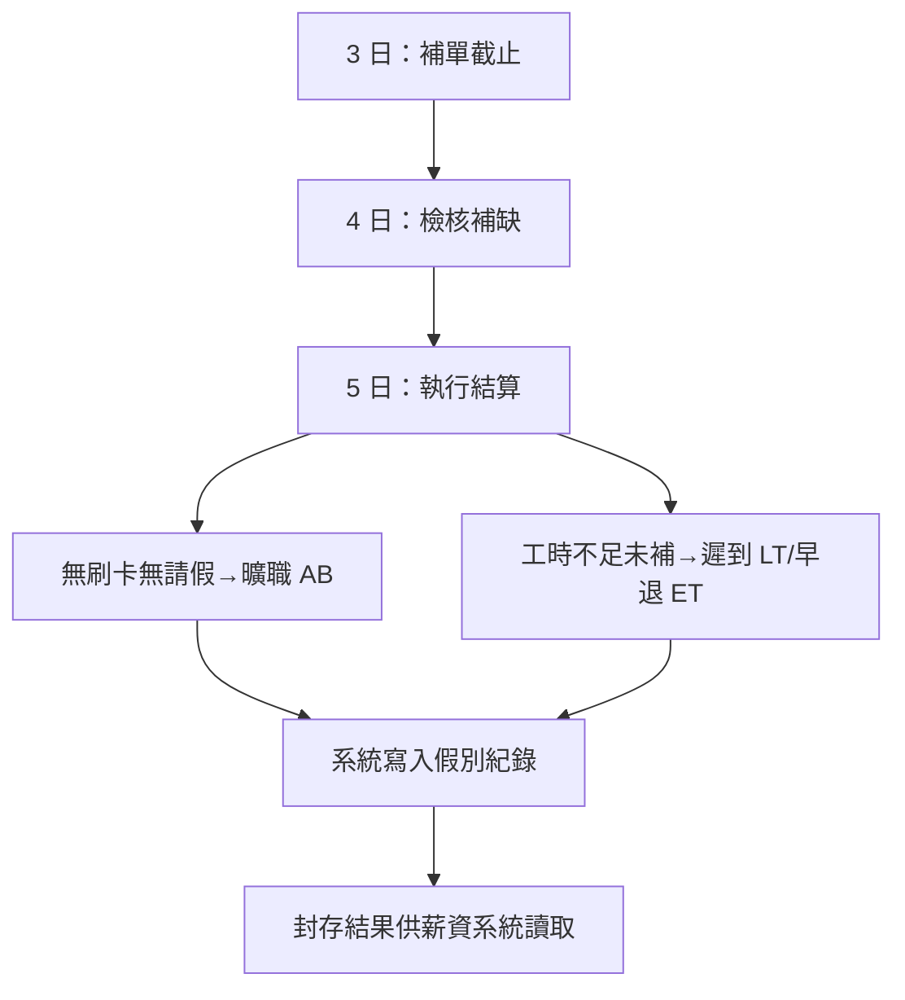
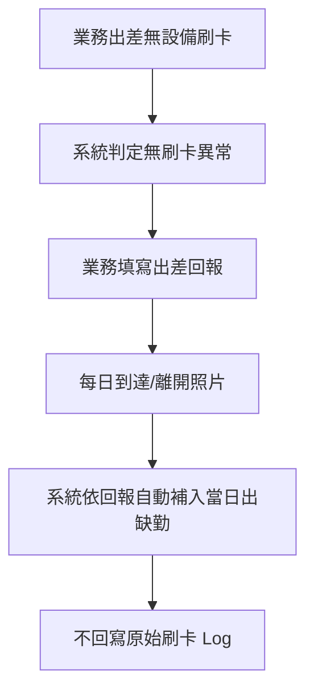
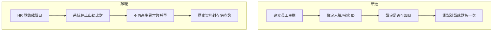
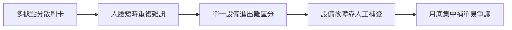
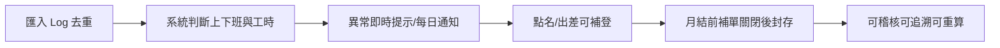
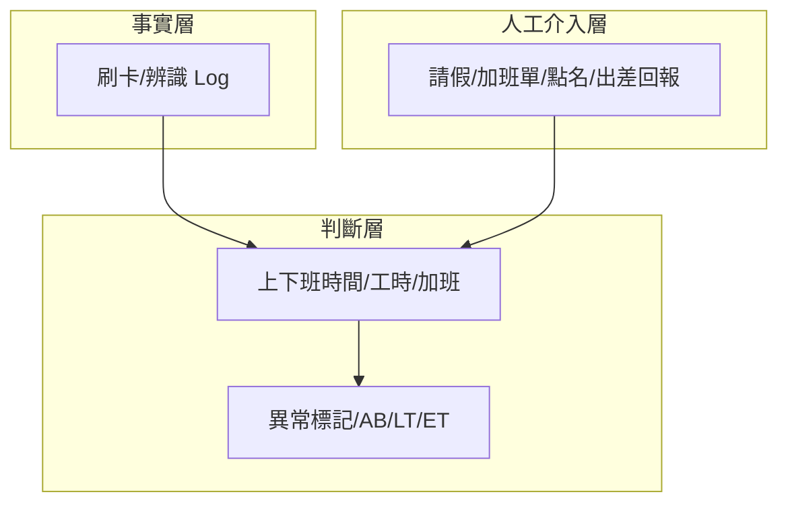

# 出缺勤系統｜流程圖

- **日期：** 2026-02-02
- **用途：** 以 Mermaid 描述出缺勤系統主要流程，供 PRD、開發與客戶確認對齊。
- **來源：** B1、C1、出缺勤系統_情境彙整

---

## 1. 日常自動流程（SC-01）

- **說明：** 事實層（Log）不可變；判斷層可重算。單一設備依時間序判斷進出。

---

## 2. 每日異常與補單（SC-02）

- **說明：** 異常通知僅在「完全無刷卡資料」時發送；補登僅影響判斷層。

---

## 3. 點名輔助流程（SC-03：設備故障／大量異常）

- **說明：** 點名僅在卡機異常或跨班／留宿確認時影響判斷層；需標示來源與核准人。

---

## 4. 月結算流程（SC-04）

- **說明：** 補單與月結時序已客戶確認：**3 日截止**（補單）→ **4 日檢核補缺** → **5 日執行結算**。AB／LT／ET 僅系統可產生；月結後結果封存。見 客戶確認用_規劃摘要 §3.6、§7。

---

## 5. 出差回報補登（SC-05）

- **說明：** 出差回報與補刷卡同級，為「出勤事實補登來源」；長時間出差仍須每日回報。

---

## 6. 新進／離職與身分治理（SC-06、SC-07）

---

## 7. As-Is 與 To-Be 對照（概念）

### 7.1 As-Is（導入前）

### 7.2 To-Be（導入後）

---

## 8. 三層資料與流程定位

- **原則：** 人工介入僅影響判斷層，不可回寫事實層 Log。
