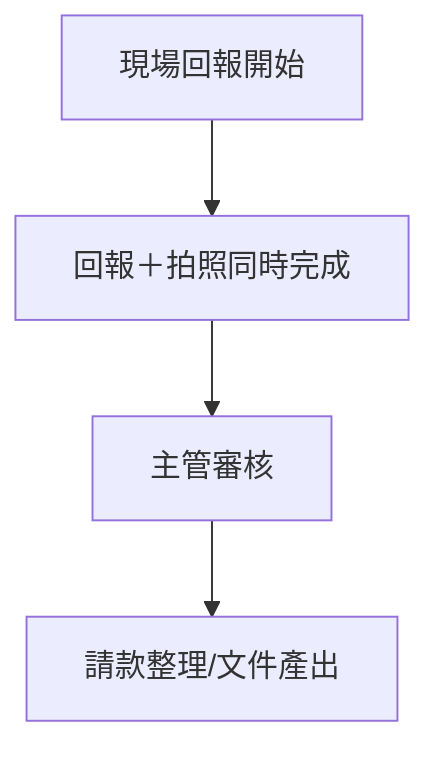
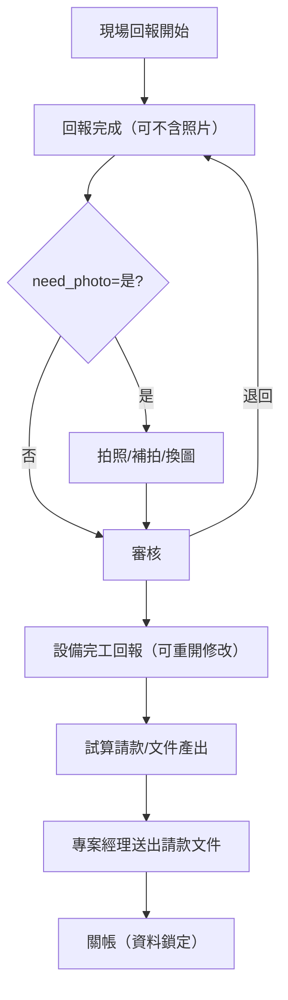
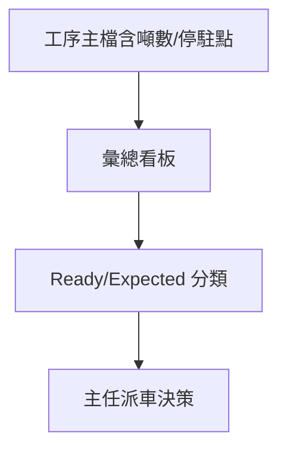

# 第二階段_流程圖
- **日期：** 2026-01-29
- **用途：** 以 Mermaid 描述 As-Is / To-Be 差異

## 1. As-Is（第一階段）

```mermaid
flowchart TD
  A[現場回報開始] --> B[回報＋拍照同時完成]
  B --> C[主管審核]
  C --> D[請款整理/文件產出]
```

## 2. To-Be（第二階段）

```mermaid
flowchart TD
  A[現場回報開始] --> B[回報完成（可不含照片）]
  B --> C{need_photo=是?}
  C -->|是| D[拍照/補拍/換圖]
  C -->|否| E[審核]
  D --> E[審核]
  E --> F[設備完工回報（可重開修改）]
  F --> G[試算請款/文件產出]
  G --> H[專案經理送出請款文件]
  H --> I[關帳（資料鎖定）]
  E -->|退回| B
```

## 3. 吊車決策輔助（彙總）

```mermaid
flowchart TD
  A[工序主檔含噸數/停駐點] --> B[彙總看板]
  B --> C[Ready/Expected 分類]
  C --> D[主任派車決策]
```
