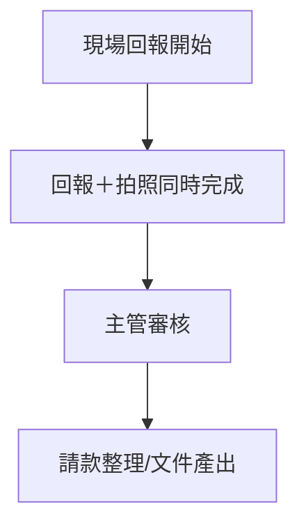
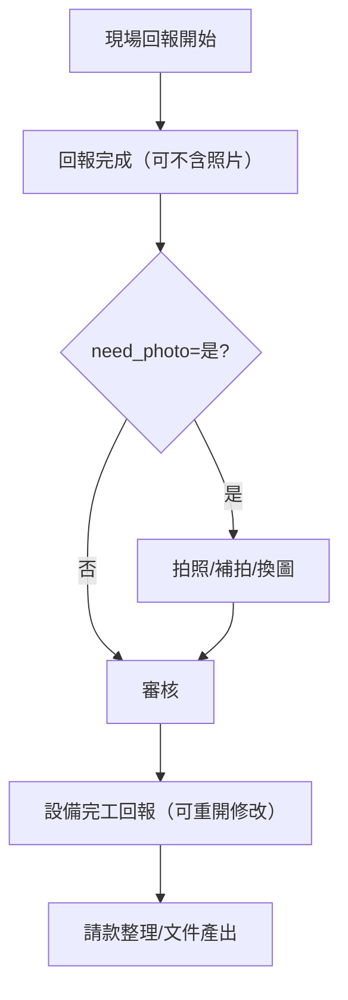

# 立國工程｜第二階段變更說明（溝通版）
- **日期：** 2026-01-29
- **專案 PM：** chinwen
- **用途：** 對齊客戶與工程師的**變更範圍**、**流程差異**與**實作影響**

## 1. 目的與範圍
本文件用於第二階段功能與流程調整的統一說明，確保**客戶理解**與**工程師落地**一致。  
本版聚焦於**流程變更**、**資料規則**與**系統影響**，作為後續 PRD/SOW 的前置對齊文件。

## 2. 假設與前提（目前以文件為準）
- 第一階段回報流程為**回報與拍照綁定**（回報時需拍照才能送出）
- 文件產出以已核定資料為主，但**缺乏可追溯的篩選條件紀錄**
- 關帳後資料**不可再變動**（請款關帳後不允許更正）

## 3. 參考資料（來源）
- `/_Inbox/變更需求補充－回報_拍照_審核流程調整（mcr）.md`
- `/_Inbox/prd－mcr_回報_拍照_吊車_請款（產品需求文件）.md`
- `/_Inbox/system_design_決策章節草案－回報_拍照_審核_請款（mcr）.md`
- `/_Inbox/作業情境與使用者旅程－mcr_回報_拍照_請款（scenario_v_2_合併版）.md`
- `/_Inbox/作業情境與使用者旅程－設備維修請款結算_吊車排程整合（scenario_use_case）.md`
- `/_Inbox/需求展開－mcr_基本資料匯入_吊車_請款（requirement_decomposition）.md`
- `/_Inbox/mcr_基本資料匯入表單對應需求與填寫說明.md`

## 4. 變更總覽（給客戶看的摘要）
> 以**業務語言**描述「改了什麼、為什麼改、帶來什麼效益」

- **改什麼：** 回報與拍照改為**雙軌**；審核可**退回補件**；文件輸出可依**工序條件篩選**；照片**可補拍/換圖且保留歷史**
- **為什麼：** 現場回報要更快、審核往返要更少、請款文件要**可追溯且可稽核**
- **帶來效益：** 減少回報等待、降低退回成本、提升請款準確性與追溯性

## 5. 變更項目清單（給工程師與內部）
| 編號 | 變更點 | 原因/痛點 | 影響流程 | 影響角色 | 系統修改 | 相關資料欄位 | 風險/注意 | 狀態 |
|---|---|---|---|---|---|---|---|---|
| C-01 | 回報/拍照**雙軌** | 回報時效被拍照卡住 | 回報與拍照拆線 | 現場、審核 | UI/狀態機 | need_report/need_photo/photo_status | 狀態需可視 | 草案 |
| C-02 | **退回補件**機制 | 審核往返成本高 | 審核流程 | 審核、現場 | 退回原因、狀態回寫 | report_status/approval_status | 退回原因需清楚 | 草案 |
| C-03 | **照片補拍/換圖**保留歷史 | 追溯與合規 | 拍照流程 | 現場、審核 | 版本化照片 | photo_history | 歷史不可刪 | 草案 |
| C-04 | 文件輸出**條件篩選** | 文件一致性不足 | 文件產出 | 請款、主管 | 篩選條件紀錄 | need_report/need_photo/parking_zone_group/crane_tonnage | 需保留 metadata | 草案 |
| C-05 | 吊車欄位**唯讀** | 避免現場修改影響派車 | 回報與看板 | 現場、主任 | 欄位鎖定 | crane_tonnage/parking_zone_group | 需回主檔修正 | 草案 |
| C-06 | 關帳後**禁止任何變更** | 合規與信任 | 關帳流程 | 審核、請款 | 鎖定權限 | close_period/lock | 已確認 | ✅ |
| C-07 | **設備完工回報** | 控制完工通知與可請款 | 回報/請款 | 現場、PM | 新增回報節點 | completion_report | 需可重開修改 | 已確認 |

## 6. 流程差異說明（As-Is vs To-Be）
> 建議以 Mermaid 呈現，讓客戶與工程師一眼理解差異

### 6.1 As-Is（現行）

### 6.2 To-Be（第二階段）

## 7. 角色影響矩陣
| 角色 | 既有流程 | 變更後流程 | 需新增/調整的操作 |
|---|---|---|---|
| 現場工程師 | 回報需拍照 | 回報可先完成、拍照可後補 | 補拍/換圖、照片狀態辨識 |
| 主管/審核者 | 審核通過/否決 | 可退回補件、看照片狀態 | 退回原因填寫、缺照片提醒 |
| PM/請款人員 | 依核定資料產出 | 依條件篩選、快照文件 | 篩選條件確認、版本追溯 |

## 8. 資料與規則變更
> 聚焦「**欄位**、**驗證規則**、**匯入順序**、**計算邏輯**」

- **新增/調整欄位：** need_report、need_photo、photo_status、crane_tonnage、parking_zone_group  
- **驗證規則：**
  - need_photo=否 → 回報不得檢核照片
  - need_photo=是 → 回報可完成但 photo_status=Pending
  - PhotoPending **可核定/請款**（與拍照流程分線）
  - crane_tonnage 若填寫，parking_zone_group 不可空白
- **文件輸出：** 需記錄篩選條件與產出時間（快照）
- **關帳後規則：** 已確認「**請款關帳後不可更正**」

## 9. 工程實作提示（Definition of Done）
- **功能完成條件：** 回報/拍照可獨立運作；退回/補件可閉環
- **資料檢核條件：** 欄位與狀態依規則變化；歷史照片可追溯
- **測試情境：** need_photo=否/是、退回補件、換圖、文件篩選
- **驗收標準：** 與 PRD/需求展開一致，文件可追溯

## 10. 待補資料清單（請協助提供）
- **第二階段確定的變更清單**（若與上述不同，請標註）
- **角色權責與權限細節**（誰可退回、誰可關帳）
- **請款結算文件範本**（後續提供即可）
- **優先順序與時程目標**

## 11. 關帳規則補充（已確認）
- **關帳前置條件：** 專案經理送出請款文件後，方可進行關帳
- **關帳定義：** **合約關帳**（請款關帳後不允許更正）
- **關帳後規則：** 關帳後**不得再變動任何請款資料**（含照片/附件）
