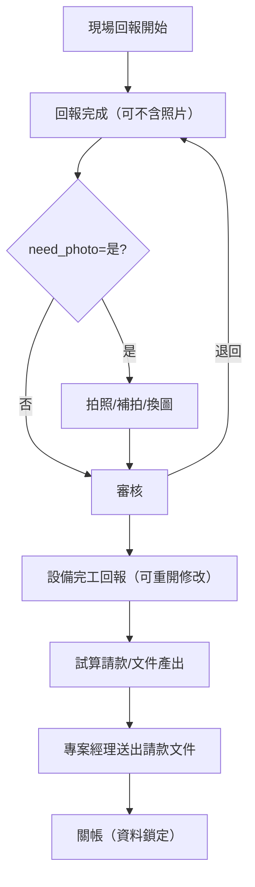

# MCR 請款流程｜參考

- **日期：** 2026-02-26
- **用途：** 供您檢視請款流程全貌；細節以 PRD、程式清單建議、MCR SOP 為準。

---

## 一、流程總覽（回報 → 請款 → 關帳）

---

## 二、請款相關步驟（文字版）

| 步驟 | 內容 | 對應主程式／備註 |
| --- | --- | --- |
| 1 | **合約簽訂時**：**客戶合約工作項目建檔**、**客戶設備對應工作項目建檔**（採**整批匯入**，程式獨立） | MCR310、MCR320 |
| 2 | **現場回報** → **審核**（核定或退回補件） | 既有 MCR210、MCR220 |
| 3 | **設備完工回報**（可重開修改，關帳前） | 請款前置 |
| 4 | **回報完工請款試算**（依實際完工數量 × 單價） | MCR330 |
| 5 | **設備追加請款建立** | MCR340 |
| 6 | **合約完工結算確認**（含監工核定、關帳後鎖定） | MCR350 |
| 7 | **結算設備請款查詢與輸出**、**結算請款總表查詢與輸出** | MCR360、MCR370 |

---

## 三、請款 SOP 要點（摘錄自 MCR SOP）

- **設備工作項目與請款數量、加成設定** → **二次清洗（資料確認）** → **監工核定** → **合約結算** → **關帳後禁止變更**。
- 請款與文件產出依**回報資料**為準；設備完工回報為請款前置。
- **實際請款**：依**實際清洗完工**結算**完成數量**，以「完成數量 × 單價（來自合約工作項目單價建檔）」計算。

---

## 四、合約簽訂時建檔與請款結算關係

| 階段 | 建檔／主程式 | 說明 |
| --- | --- | --- |
| **合約簽訂時** | **MCR310** 客戶合約工作項目建檔 | **先選合約**後整批匯入（下載範本填寫再匯入）；不提供單筆新增；重新匯入可清除原資料重匯；匯入後檢查未對應項目並提示至 MCR320 |
| **合約簽訂時** | **MCR320** 客戶設備對應工作項目建檔 | 設備 × 工作項次 × 預計數量；**整批匯入**，程式編碼獨立 |
| **實際清洗完工** | 完成數量 | 依完工回報結算 |
| **主要 e 化主作業** | MCR330 回報完工請款試算、MCR340 設備追加請款建立、MCR350 合約完工結算確認、MCR360／MCR370 結算查詢與輸出 | 完成數量 × 單價；產出請款文件、關帳後鎖定 |

---

## 五、主要 e 化主作業清單（對應程式清單）

- **MCR310** 客戶合約工作項目建檔（整批匯入，獨立）
- **MCR320** 客戶設備對應工作項目建檔（整批匯入，獨立）
- **MCR330** 回報完工請款試算
- **MCR340** 設備追加請款建立
- **MCR350** 合約完工結算確認
- **MCR360** 結算設備請款查詢與輸出
- **MCR370** 結算請款總表查詢與輸出

---

## 六、相關文件

- **PRD：** `03_Solution/PRD_立國工程_MCR_第二階段.md` §4 核心流程、§5 功能模組
- **MCR SOP：** `docs/MCR/SOP.md` §3 請款SOP
- **程式清單：** `03_Solution/MCR_工程請款結算_程式清單建議.md`（v0.4 主作業清單；MCR310 雛型與操作說明見同目錄 `2026-02-26_prototype_MCR310*`）
- **工程規格草案：** `03_Solution/工程規格草案_MCR_第二階段.md` §3 API、§4 權限
