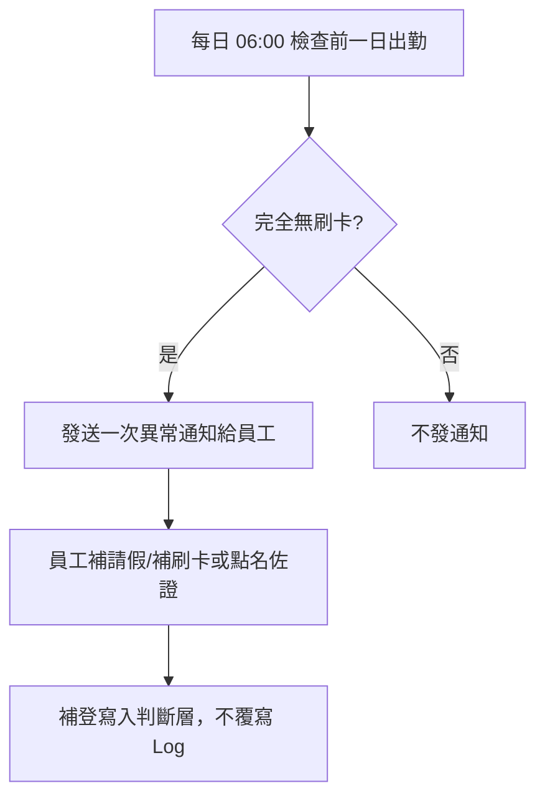
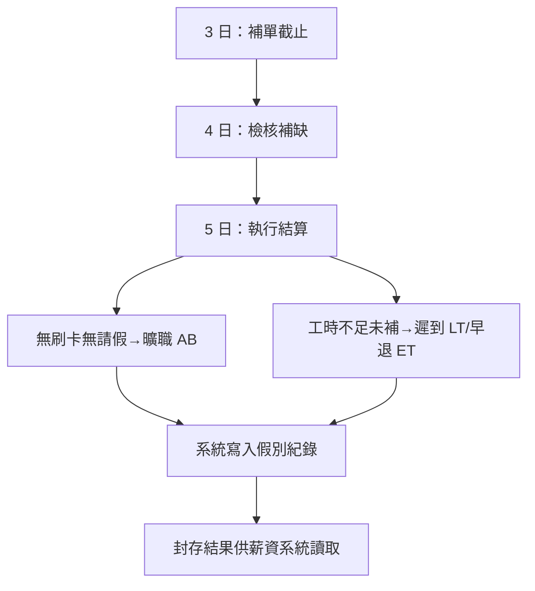

# PRD｜出缺勤系統（人臉／指紋辨識）

- **日期：** 2026-02-02
- **版本：** v1.0
- **用途：** 提供工程師開發與驗收依據
- **來源：** B1 業務需求與導入規劃說明、C1 需求展開拆解、02_Analysis 客戶確認結論與分析產物

---

## 1. 產品目標與成功指標

### 1.1 產品目標

1. 建立**可稽核、可追溯、可重算**的出缺勤制度
2. 將制度判斷前移到系統，降低月底人工作業與爭議
3. 清楚區分：事實層（刷卡／辨識 Log）→ 判斷層（出勤結果）→ 人工介入層（請假／加班／點名／出差）
4. 出缺勤資料在進入薪資前完成法規稽核，不減損員工依法應得加班報酬

### 1.2 成功指標（KPI）

- 出缺勤資料在進入薪資前已完成法規稽核
- 無因制度調整而減損員工依法應得加班報酬
- 超時工作以制度化獎勵方式補償，符合法規精神
- 勞檢可清楚說明工時、加班、補償三者關係
- 月底補單爭議與人工整理負擔明顯下降

### 1.3 本階段範圍

- **包含：** 刷卡／辨識匯入、去重、上下班與工時判斷、加班計算（依資格）、異常提示、補單流程、點名輔助、出差回報補登、月結算（AB／LT／ET）、法規稽核、封存供薪資讀取
- **不包含：** 薪資計算與發放（出缺勤結果僅作為下游系統輸入）

---

## 2. 使用者角色與權限摘要

### 2.1 角色與權限矩陣（已確認）

| 角色 | 主要權限 |
| --- | --- |
| 員工 | 查詢本人出勤狀態、收到異常通知後補請假／補刷卡或提供點名佐證 |
| 各部門主管或助理 | **點名**（到班／請假／未到）、**月結**（所屬部門或權責範圍）、**看稽核紀錄** |
| HR | 員工主檔維護、到職／離職登錄、辨識 ID 綁定、**查詢全員出勤**、點名批次補入之核准與紀錄留存 |
| HR 與平台管理者 | **維護勞基法參數**（每日／每月加班上限、級距等） |
| 管理主管 | **查詢全員出勤** |
| 業務人員 | 出差期間每日填寫出差回報（到達／離開照片），作為無刷卡時之補登依據 |
| 系統（自動） | 匯入刷卡 Log、去重、判斷上下班與工時、計算加班、法規稽核、每日 06:00 異常通知、月結寫入 AB／LT／ET、封存 |

### 2.2 權限細化（PRD 實作建議）

- 員工：僅能查詢**本人**出勤、異常、補單狀態
- 各部門主管或助理：點名、月結、看稽核紀錄以**所屬部門或權責範圍**為限（具體範圍依系統權限設定）
- HR／管理主管：可查**全員**出勤

---

## 3. 核心資料與狀態模型

### 3.1 三層資料模型

| 資料層 | 說明 | 規則 |
| --- | --- | --- |
| **事實層（raw）** | 人臉／指紋刷卡紀錄（Log） | 不可變、不刪除、不回寫；點名與出差回報不覆蓋 Log |
| **判斷層（computed）** | 系統計算之出勤結果（上下班、工時、加班、異常標記） | 可重算；人工介入（請假、加班單、點名、出差回報）僅影響此層 |
| **人工介入層（manual）** | 請假、補休、加班單、點名、出差回報 | 需核准、標示來源與核准人；不覆蓋事實層 |

### 3.2 假別與狀態（系統產出）

| 類型 | 代碼／狀態 | 說明 |
| --- | --- | --- |
| 假別（僅系統月結產生） | AB（曠職） | 無刷卡、無請假 |
| 假別（僅系統月結產生） | LT（遲到）／ET（早退） | 工時不足未補 |
| 點名標記 | present / on_leave / absent | 到班／請假／未到 |
| 員工狀態 | Active / Inactive | 在職／離職；離職日起不參與出勤判斷、不產生異常與補單 |

### 3.3 關鍵欄位（引用）

- 詳見 **02_Analysis/出缺勤系統_名詞與欄位對照清單**（標準欄位名、狀態與代碼彙總、客戶確認參數 §4之一）。

---

## 4. 核心流程（To-Be）

### 4.1 日常自動流程

- 事實層 Log 不可變；判斷層可重算。單一設備依時間序判斷進出。

### 4.2 每日異常與補單

- 異常通知僅在「完全無刷卡資料」時發送；每日 06:00 執行（已確認）。

### 4.3 補單與月結時序（已確認）

- **補單截止：** 每月 3 號前要完成前一月的補單。  
- **4 日檢核補缺、5 日執行結算**；月結後不回頭修改，錯誤更正透過簽呈與金額調整、不回寫出缺勤紀錄。

### 4.4 點名輔助（設備故障／大量異常）

- 卡機異常或大量刷卡缺失時，各部門主管或助理啟用點名模式 → 勾選到班／請假／未到 → 批次補入出缺勤與加班 → 留存核准紀錄；點名資料不覆蓋刷卡 Log。點名用途為跨部門支援時確認接收人力工時（歸屬與統計）。

### 4.5 出差回報補登

- 業務出差無設備刷卡時，填寫出差回報（每日到達／離開照片）→ 系統依回報自動補入當日出缺勤；不回寫原始刷卡 Log。長時間出差仍須每日回報。

---

## 5. 功能模組與畫面／介面需求

### 5.1 員工與身分治理模組

- **目的：** 建立與維護員工基本資料、辨識綁定、到職／離職登錄
- **權限：** HR
- **功能／畫面**
  - 員工主檔維護（員工編號、部門、到職日、離職日、是否需刷卡、是否可加班、不計加班人員標記）
  - 人臉／指紋辨識 ID 綁定（一對多）
  - 到職／離職登錄；離職日起系統停止出勤比對與異常
- **行為規則**
  - 員工狀態為「離職」後不參與出勤判斷、不產生異常與補單；歷史資料僅供查詢與稽核
  - 異動需具備生效日、可追蹤

### 5.2 刷卡／辨識資料整合模組

- **目的：** 匯入人臉／指紋刷卡 Log，支援多設備、多地點、單一設備進出共用
- **功能／介面**
  - 刷卡 Log 匯入（介面形式、頻率、負責單位：**待規格**，見 §6）
  - 短時間重複讀取去重（去重間隔：**待規格**，建議如 60 秒內同人同設備僅保留一筆）
  - 設備與據點設定（device_id、location、是否進出共用）
- **行為規則**
  - 原始 Log 不可修改、不刪除；Log 僅作為事實層輸入
  - 可處理大量資料、支援批次匯入與回補

### 5.3 點名與人工介入模組

- **目的：** 提供點名作業（到班／請假／未到）、批次補入出缺勤與加班；支援跨部門支援人力歸屬與工時統計
- **權限：** 各部門主管或助理
- **功能／畫面**
  - 點名作業（勾選到班／請假／未到名單、跨班／留宿名單標示）
  - 批次補入出缺勤與加班；標示核准人與來源
- **行為規則**
  - 以刷卡為主；刷卡異常時可填寫加班單或請假單修正。點名僅在卡機異常或跨班／留宿確認時影響判斷層；點名資料不得覆蓋刷卡 Log

### 5.4 出勤判斷引擎模組

- **目的：** 判斷上班日／假日、上班／下班時間、計算上班工時；產出異常標記；支援重算
- **功能**
  - 依班別與行事曆判斷上班日／假日；第一筆有效進＝上班時間、最後一筆有效出＝下班時間；單一設備依時間序判斷
  - 計算上班工時與加班（依資格）；標示異常待處理
  - 判斷結果可重算、支援異動後回溯計算
- **畫面／API**
  - 出勤結果查詢（員工本人；HR／管理主管可查全員）；重算觸發（後台或排程）

### 5.5 加班與法規稽核模組

- **目的：** 計算平日／假日加班、稽核每日與每月加班上限；法定內列入薪資、超限轉點數／獎金；保留稽核紀錄供勞檢
- **權限：** 勞基法參數維護為 HR 與平台管理者；稽核紀錄查詢依權限矩陣
- **功能／畫面**
  - 加班計算與稽核結果；勞基法參數檔維護（每日／每月上限、級距；**依賴主檔**，見 §6）
  - 超限轉為加班工作點數／工作獎金基礎量；不刪減法定內加班
  - 稽核紀錄查詢（各部門主管或助理可看稽核紀錄）
- **行為規則**
  - 法定範圍內加班必須完整進入薪資計算用欄位；超過法定上限工時轉換為點數／獎金、不列入加班費
  - 不計加班人員：不納入自動加班稽核，超時註記「留廠未投入工作」，加班須申請單；緊急工作補償由當事人填寫加班申請單核可後補入或月工作獎金發放

### 5.6 月結算與假別生成模組

- **目的：** 依補單與月結時序（3 日截止→4 日檢核補缺→5 日執行結算）產出月結結果、寫入 AB／LT／ET、封存供薪資讀取
- **權限：** 各部門主管或助理（月結）、HR
- **功能／畫面**
  - 補單截止（每月 3 日）；4 日檢核補缺；5 日執行結算
  - 無刷卡無請假→曠職（AB）；工時不足未補→遲到（LT）／早退（ET）；僅系統可產生 AB／LT／ET
  - 封存結果供薪資系統讀取（介面：**待規格**，見 §6）
- **行為規則**
  - 月結後不回頭修改；計算錯誤透過簽呈與金額調整發放，**不回寫出缺勤紀錄資料**

### 5.7 通知與查詢模組

- **目的：** 員工查詢本人出勤、異常通知、出差回報補登
- **功能／畫面**
  - 員工自助查詢出勤狀態、異常與補單狀態
  - 每日 06:00 執行前一日出勤檢查，僅在「完全無刷卡資料」時發送一次異常通知
  - 出差回報：業務填寫每日到達／離開照片，系統依回報自動補入當日出缺勤（不回寫 Log）
- **行為規則**
  - 出差回報與補刷卡同級，為出勤事實補登來源；長時間出差仍須每日回報；出差照片需時間戳記（定位若可行則選填）

---

## 6. 介面與整合（待規格）

以下於開發階段與 HR／IT／設備廠商對齊，PRD 標註「待規格」：

| 項目 | 說明 | 建議 PRD／規格寫法 |
| --- | --- | --- |
| 刷卡資料取得方式 | 人臉／指紋設備以何種方式進入系統（API、檔案、手動匯入）、頻率、負責單位 | 待與設備／IT 規格對接 |
| 薪資系統介面 | 月結封存後如何提供給薪資系統（檔案、API、共用 DB） | 待與薪資系統對接規格 |
| 點名為本系統或外部 | 點名為本系統畫面或外部系統；若外部需介面規格 | PRD 預設為本系統畫面；若為外部需介面規格 |
| 班別主檔 | 班別由誰維護、欄位為何、是否與現有 HR 系統共用 | 列為依賴主檔；若由他系統維護需註明介面 |
| 公司行事曆 | 工作日／例假日／國定假日由誰維護、更新頻率 | 列為依賴並註明維護責任 |
| 請假類型／假別主檔 | 請假單之假別（病假、事假、特休等）來源；與月結假別（AB/LT/ET）關係 | 區分「請假申請用假別」與「月結產出假別」，註明主檔來源 |
| 勞基法參數檔 | 每日／每月加班上限、級距；維護者已確認為 HR 與平台管理者 | 列為依賴主檔，建議欄位 daily_cap, monthly_cap 等 |
| 刷卡去重間隔 | 「短時間」重複讀取之具體秒數／分鐘數 | 建議 60 秒內同人同設備僅保留一筆，或列為可設定參數 |

---

## 7. 非功能需求（NFR）

- 事實層（刷卡 Log）不可變、不刪除、不回寫；人工介入僅影響判斷層
- 判斷層結果可重算、支援異動後回溯計算
- 所有異動與補登需可追溯（來源、核准人、時間）
- 可處理大量資料（設備異常時批次匯入與回補）
- 稽核紀錄保留，供勞檢單位查核與內部稽核
- 月結封存後資料鎖定，供薪資系統讀取；錯誤更正不回寫出缺勤紀錄
- UI 操作需適合 HR、各部門主管／助理、員工使用（含手機查詢若需求）

---

## 8. 已確認決策

以下已於 B1／C1 或客戶確認定案，開發時直接引用；詳見 **02_Analysis/出缺勤系統_客戶確認用_規劃摘要 §3、§7**。

### 8.1 流程與時程

- **補單期限：** 每月 3 號前要完成前一月的補單
- **異常通知時點：** 每天早上 6:00 通知，前一日是否有需要確認的資料
- **補單與月結時序：** 3 日截止（補單）→ 4 日檢核補缺 → 5 日執行結算

### 8.2 點名與刷卡、月結後追溯

- **點名與刷卡：** 以刷卡為主；刷卡異常可填寫加班單或請假單修正。點名為跨部門支援時確認接收人力工時（歸屬與統計）之輔助
- **月結後追溯：** 月結後不回頭修改；計算錯誤用下個月補發或扣回方式沖回；錯誤更正透過簽呈與金額調整發放，**不回寫出缺勤紀錄資料**
- **支援人力加班歸屬：** 依照點名確認支援人力該員工的歸屬

### 8.3 加班與身分

- **不可加班人員緊急工作補償：** 由當事人填寫加班申請單核可後補入，或用月工作獎金發放
- **夜班／跨日班、留宿：** 立國無三班制；留宿不視為夜班、不列入加班，需留宿單
- **管理職／不計加班：** 不納入自動加班稽核，超時註記「留廠未投入工作」，加班須申請單
- **超限加班：** 超過法定可計薪上限之工時轉為點數／獎金基礎量，不列入加班費
- **離職員工：** 離職日起停止出勤比對、不產生異常與補單，歷史僅供查詢

### 8.4 權限矩陣

- 點名、月結、看稽核紀錄：各部門主管或助理
- 維護勞基法參數：HR 與平台管理者
- 查詢全員出勤：HR 與管理主管

---

## 9. 驗收重點

- 離職日起不再比對刷卡、不產生異常與補單
- 原始刷卡 Log 不因點名或出差回報而覆寫
- 法定範圍內加班完整進入薪資計算用欄位；超限轉點數／獎金基礎、不刪減
- 月結算後結果封存，供薪資系統讀取；月結後不回溯修改；錯誤更正不回寫出缺勤紀錄
- 刷卡異常通知僅在「完全無刷卡資料」時發送；每日 06:00 執行前一日檢查
- 出差回報可補登當日出缺勤；AB／LT／ET 僅系統於月結產生
- 補單與月結時序：3 日截止→4 日檢核補缺→5 日執行結算
- 權限：點名／月結／稽核→各部門主管或助理；勞基法參數→HR 與平台管理者；全員出勤→HR 與管理主管

---

## 10. 參考文件

| 文件 | 位置 | 說明 |
| --- | --- | --- |
| 業務需求與導入規劃說明（B1） | _Inbox | 制度、SOP、Gap、勞基法稽核定位 |
| 需求展開拆解（C1） | _Inbox | 七大模組、功能／規則／非功能、TBD 結案 |
| 客戶確認用_規劃摘要 | 02_Analysis | 客戶確認結論 §3、§7（權限、時序、錯誤更正等） |
| 需求展開_對照 | 02_Analysis | 需求項目與模組／決策對照、驗收條件 |
| 情境彙整 | 02_Analysis | 情境 SC-01～SC-11、角色責任 |
| 流程圖 | 02_Analysis | 日常、異常、點名、月結（3→4→5）、出差、As-Is／To-Be |
| 名詞與欄位對照清單 | 02_Analysis | 名詞、狀態、假別、標準欄位、客戶確認參數 |
| 仍待確認與需補充清單 | 02_Analysis | 仍待確認、待規格、已結案總覽 |
| PRD展開前檢核與建議 | 02_Analysis | 缺口、客戶確認結論、PRD 撰寫建議 |
