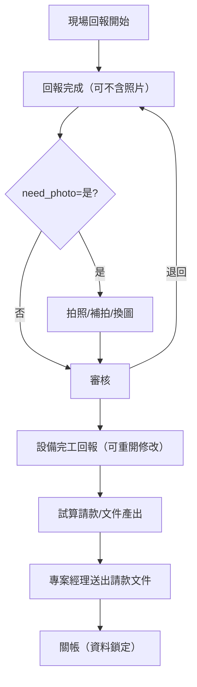

# PRD｜立國工程 MCR 第二階段

- **日期：** 2026-01-29
- **版本：** v1.0
- **用途：** 提供工程師開發與驗收依據
- **來源：** `99_Trace` 中已確認的 PRD / Scenario / 需求展開

## 1. 產品目標與成功指標

### 1.1 產品目標

1. 回報與拍照拆線，縮短回報時效
2. 降低審核往返成本，支援退回與補件
3. 請款與文件產出依回報資料為準
4. 資料可追溯、可鎖定、可說明

### 1.2 成功指標（KPI）

- 現場回報平均完成時間下降 ≥ 30%
- 審核退回平均次數下降
- 因照片不齊導致回報卡關趨近 0
- 請款文件補件次數顯著下降

## 2. 使用者角色與權限摘要

| 角色 | 主要權限 |
| --- | --- |
| 現場人員 | 回報、拍照、補拍、換圖 |
| 專案經理 | 設備管理、**設備完工回報**、請款試算、送出請款文件 |
| 監工/客戶主管 | 審核、退回 |
| 請款人員 | 文件產出、送出請款 |

## 3. 核心資料與狀態模型（摘要）

### 3.1 工序控制欄位

- need_report
- need_photo
- crane_tonnage
- parking_zone_group

### 3.2 狀態模型（最小可行）

| 類型 | 狀態 |
| --- | --- |
| 回報狀態 | Draft / Reported / Returned / Approved |
| 照片狀態 | NotRequired / Pending / Completed |

## 4. 核心流程（To-Be）

## 5. 功能模組與畫面需求

### 5.1 回報清單畫面（工序層級）

- **目的**：快速完成回報，不因拍照阻塞
- **行為規則**
  - need_photo=否：提交不檢核照片
  - need_photo=是：提交後 photo_status=Pending
  - PhotoPending **可核定/請款**

### 5.2 拍照/照片管理畫面

- **目的**：補拍、換圖並保留歷史
- **行為規則**
  - 新照片成為 Current
  - 舊照片轉為 History

### 5.3 審核畫面（含退回）

- **目的**：縮短審核流程
- **行為規則**
  - 退回不刪資料
  - 原回報可補件並可重新回報

### 5.4 文件產出畫面（Excel / Word）

- **目的**：依工序條件產出合規文件
- **行為規則**
  - 預設使用 Current 照片
  - 篩選條件需記錄

### 5.5 設備完工回報

- **目的**：控制「可請款」通知
- **行為規則**
  - 完工回報可重開修改（關帳前）
  - 作為請款整理/文件產出的前置條件

## 6. 非功能需求（NFR）

- 所有回報與照片異動需可追溯
- 關帳後資料需鎖定
- UI 操作需適合現場手機使用

## 7. 已確認決策

- **合約關帳**：請款關帳後不允許更正
- **PhotoPending 可核定/請款**
- **退回後可重新回報**
- **文件產出為快照**並保留 metadata
- **吊車欄位只讀**（由主檔維護）

## 8. 驗收重點

- need_photo=否 → 回報不可阻擋
- need_photo=是 → 回報完成且 photo_status=Pending
- PhotoPending 可進入核定/請款流程
- 設備完工回報可重開修改（關帳前）
- 文件產出可追溯篩選條件

## 9. 參考文件

- `99_Trace/prd－mcr_回報_拍照_吊車_請款（產品需求文件）.md`
- `99_Trace/作業情境與使用者旅程－mcr_回報_拍照_請款（scenario_v_2_合併版）.md`
- `99_Trace/需求展開－mcr_基本資料匯入_吊車_請款（requirement_decomposition）.md`
