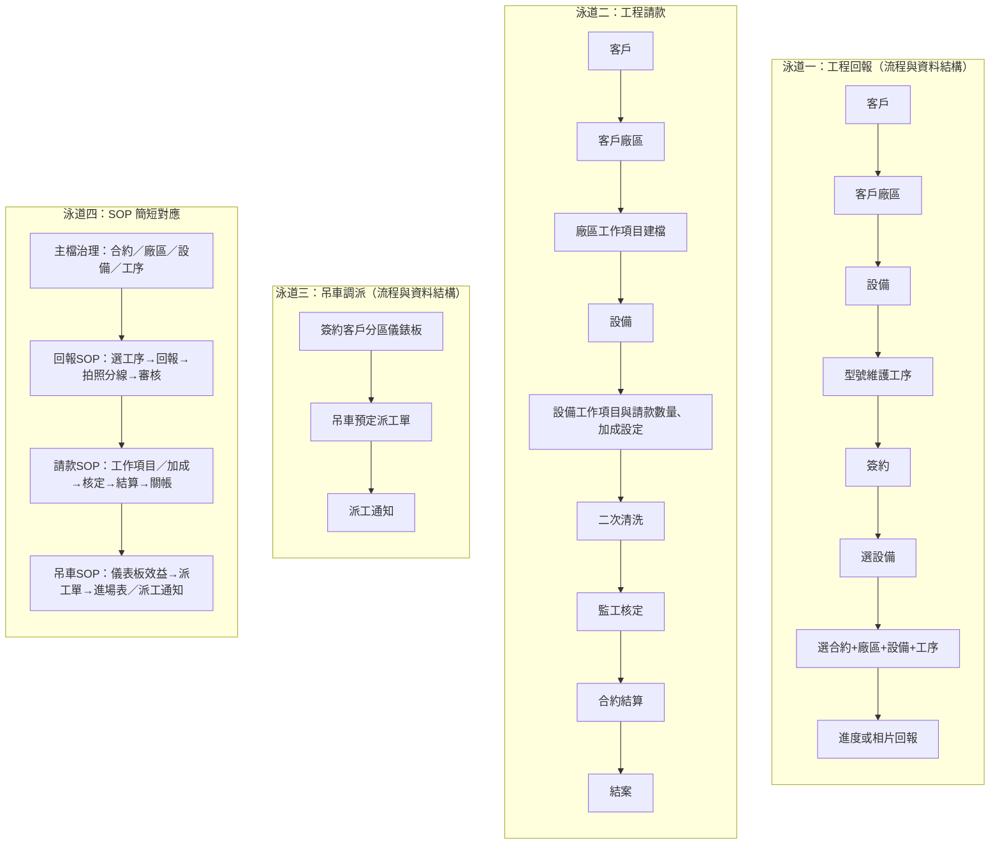

# 工程回報 × 請款 × 吊車調派｜泳道圖（含 SOP 對應）

- **日期：** 2026-01-30
- **用途：** 整合工程回報、工程請款、吊車調派之流程與資料結構，並以泳道圖呈現；另增一道 SOP 簡短對應，供檢核與訓練用。
- **對應規格：** `工程規格草案_MCR_第二階段.md`、`表單與名詞對照清單_欄位引用標準.md`

---

## 1. 泳道圖總覽（四道：回報／請款／吊車／SOP）



---

## 2. 各泳道節點說明（流程與資料結構）

| 泳道 | 節點 | 說明／資料來源 |
| ---- | ---- | -------------- |
| 工程回報 | 客戶 → 客戶廠區 → 設備 → 型號維護工序 | 主檔：合約、廠區、設備、型式工序（含 need_report / need_photo / crane_tonnage / parking_zone_group） |
| 工程回報 | 簽約 → 選設備 → 選合約+廠區+設備+工序 | 回報清單篩選；僅顯示 need_report=是 之工序 |
| 工程回報 | 進度或相片回報 | equipment_process_report、equipment_photo；回報／提交／退回／核定 |
| 工程請款 | 客戶 → 客戶廠區 → 廠區工作項目建檔 | 請款主檔：工作項目、加成 |
| 工程請款 | 設備 → 設備工作項目與請款數量、加成設定 | 依設備／工序綁定請款數量與加成 |
| 工程請款 | 二次清洗 → 監工核定 → 合約結算 → 結案 | completion_report、billing_snapshot；核定／關帳後鎖定 |
| 吊車調派 | 簽約客戶分區儀錶板 | 停駐點彙總（可吊卸／排吊卸，≤60／>60）；資料來源：每日報工＋停駐點主檔 |
| 吊車調派 | 吊車預定派工單 | crane_assignment（停駐點+噸數+入場日期+廠商+快照）；列印進場表 |
| 吊車調派 | 派工通知 | 現場趕工／準備作業通知（可吊掛只統計、排吊卸列明細＋吊掛前未完成工序） |
| SOP 對應 | 主檔治理 → 回報SOP → 請款SOP → 吊車SOP | 各階段簡短檢核與訓練用；詳見操作手冊與合規規範 |

---

## 3. SOP 簡短補入（泳道四對照）

| 階段 | SOP 要點（簡短） |
| ---- | ---------------- |
| 主檔治理 | 合約、廠區、設備、型式工序、工作項目、加成、吊車停駐點區／噸數由主檔維護；回報端吊車欄位只讀。 |
| 回報SOP | 選合約+廠區+設備+工序 → 完成回報（可不含照片）→ need_photo=是則補拍 → 審核／退回→核定；退回需填原因。 |
| 請款SOP | 設備工作項目與請款數量、加成設定 → 二次清洗（資料確認）→ 監工核定 → 合約結算 → 關帳後禁止變更。 |
| 吊車SOP | 儀表板查停駐點效益（可吊卸/排吊卸）→ 預定派車建檔（停駐點+噸數+入場日期）→ 列印進場表／派工通知；派工單供現場趕工與準備作業。 |

---

## 4. 跨泳道關係（簡要）

- **回報 → 請款：** 請款與文件產出依回報資料為準；設備完工回報為請款前置。
- **回報 → 吊車：** 儀表板數字由回報／工序彙總（crane_tonnage、parking_zone_group）；吊車欄位由主檔維護。
- **SOP：** 主檔治理為三條流程共用；回報／請款／吊車各有對應 SOP，生成或修訂文件時須引用 `00_Templates/Markdown_合規規範.md` 與本專案表單／名詞對照清單。

---

## 5. 如何檢視本流程圖（Mermaid 工具與方式）

以下任一種方式皆可檢視 `.md` 內產生的 Mermaid 流程圖。

| 方式 | 作法 | 適用情境 |
| ---- | ---- | -------- |
| **Cursor / VS Code 擴充** | 安裝 **Mermaid Preview** 或 **Markdown Preview Mermaid Support**，在編輯器內對 `.md` 按「預覽」（Ctrl+Shift+V 或右鍵 → Open Preview），即可在預覽畫面看到流程圖。 | 在 IDE 內邊改邊看，最方便。 |
| **Mermaid Live Editor（線上）** | 開啟 [https://mermaid.live](https://mermaid.live)，將本檔案中 ` ```mermaid ` 與 ` ``` ` 之間的程式碼複製貼上左側，右側即時顯示流程圖；可匯出 PNG/SVG。 | 不需安裝、可匯出圖檔、分享連結。 |
| **本專案 MkDocs** | 在專案根目錄執行 `mkdocs serve`，用瀏覽器開啟 `http://127.0.0.1:8000`；若本檔案已納入 `mkdocs.yml` 的 nav，點選該頁即可看到渲染後的 Mermaid 圖。 | 與整份文件一起瀏覽、對外發布。 |
| **GitHub** | 將 `.md` 推上 GitHub，在倉庫內開啟該檔案；GitHub 已內建 Mermaid 渲染，直接顯示流程圖。 | 版本控管後在網頁上檢視。 |

**建議：** 日常在 Cursor 用「Markdown 預覽」即可檢視與微調；要匯出圖檔或分享時用 Mermaid Live；要與整份手冊一起看時用 `mkdocs serve`。
