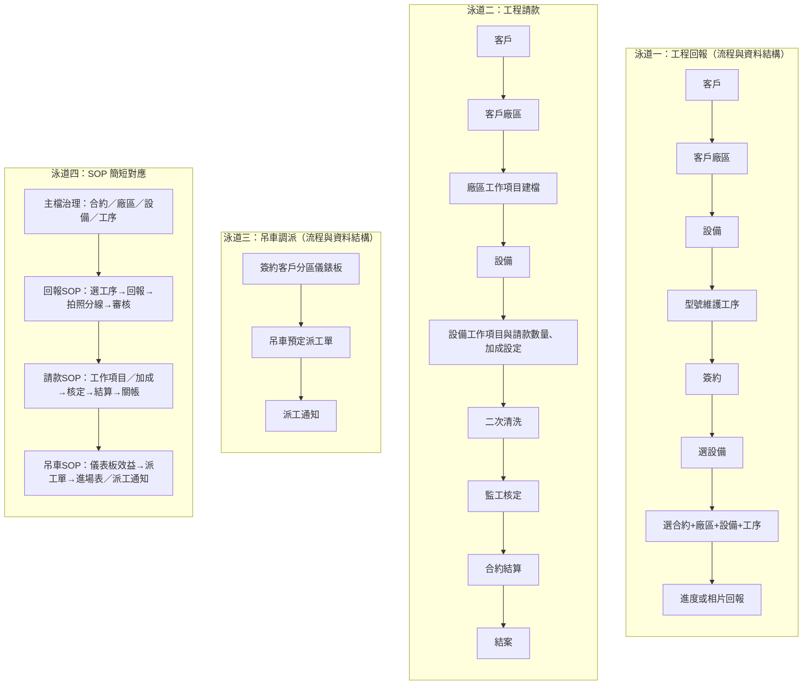

# MCR－SOP（組織角色與作業流程）

- **日期：** 2026-01-30
- **版本：** v1.0
- **用途：** 以泳道圖與說明呈現 MCR 相關之**組織角色**與**作業 SOP**；工程回報、工程請款、吊車調派及對應 SOP 一併呈現。
- **說明：** 吊車調派規劃目前**暫停**（現場主管評估暫不需要）；泳道三與吊車 SOP 保留供日後恢復。

---

## 1. 泳道圖總覽（組織角色與作業四道）

以下泳道分別代表**不同作業線與角色責任**，第四道為各階段 **SOP 簡短對應**，供檢核與訓練用。



---

## 2. 各泳道節點說明（組織角色與作業對應）

| 泳道 | 節點 | 說明／角色與作業 |
| --- | --- | --- |
| 工程回報 | 客戶 → 客戶廠區 → 設備 → 型號維護工序 | 主檔由管理端維護：合約、廠區、設備、型式工序（含 need_report / need_photo / crane_tonnage / parking_zone_group） |
| 工程回報 | 簽約 → 選設備 → 選合約+廠區+設備+工序 | 回報清單篩選；僅顯示 need_report=是 之工序；**現場人員**選單操作 |
| 工程回報 | 進度或相片回報 | equipment_process_report、equipment_photo；**現場人員**回報／提交，**主管**審核／退回／核定 |
| 工程請款 | 客戶 → 客戶廠區 → 廠區工作項目建檔 | 請款主檔：工作項目、加成；**管理／請款承辦**維護 |
| 工程請款 | 設備 → 設備工作項目與請款數量、加成設定 | 依設備／工序綁定請款數量與加成 |
| 工程請款 | 二次清洗 → 監工核定 → 合約結算 → 結案 | completion_report、billing_snapshot；**監工**核定，**關帳**後鎖定 |
| 吊車調派 | 簽約客戶分區儀錶板 | 停駐點彙總（可吊卸／排吊卸，≤60／>60）；資料來源：每日報工＋停駐點主檔（**規劃暫停**） |
| 吊車調派 | 吊車預定派工單 | crane_assignment（停駐點+噸數+入場日期+廠商+快照）；列印進場表 |
| 吊車調派 | 派工通知 | 現場趕工／準備作業通知（可吊掛只統計、排吊卸列明細＋吊掛前未完成工序） |
| SOP 對應 | 主檔治理 → 回報SOP → 請款SOP → 吊車SOP | 各階段簡短檢核與訓練用；詳見下表與操作手冊 |

---

## 3. SOP 要點（組織角色與作業對照）

| 階段 | 組織角色／作業 | SOP 要點 |
| --- | --- | --- |
| 主檔治理 | 管理端／主檔維護 | 合約、廠區、設備、型式工序、工作項目、加成、吊車停駐點區／噸數由主檔維護；回報端吊車欄位只讀。 |
| 回報SOP | 現場人員 → 主管審核 | 選合約+廠區+設備+工序 → 完成回報（可不含照片）→ need_photo=是則補拍 → 審核／退回→核定；退回需填原因。 |
| 請款SOP | 請款承辦／監工 | 設備工作項目與請款數量、加成設定 → 二次清洗（資料確認）→ 監工核定 → 合約結算 → 關帳後禁止變更。 |
| 吊車SOP | 派工／現場（規劃暫停） | 儀表板查停駐點效益（可吊卸/排吊卸）→ 預定派車建檔（停駐點+噸數+入場日期）→ 列印進場表／派工通知；派工單供現場趕工與準備作業。 |

---

## 4. 跨泳道關係（角色協作簡要）

- **回報 → 請款：** 請款與文件產出依回報資料為準；設備完工回報為請款前置；**現場回報**與**請款／監工**需依序配合。
- **回報 → 吊車：** 儀表板數字由回報／工序彙總（crane_tonnage、parking_zone_group）；吊車欄位由主檔維護（吊車規劃暫停）。
- **SOP 檢核：** 主檔治理為三條流程共用；回報／請款／吊車各有對應 SOP，新人訓練或稽核時可依泳道四與上表對照操作手冊執行。

---

## 5. 如何檢視本流程圖（Mermaid）

| 方式 | 作法 |
| --- | --- |
| **Cursor / VS Code** | 安裝 Mermaid 預覽擴充，對本檔按「預覽」即可看到流程圖。 |
| **Mermaid Live** | 開啟 <https://mermaid.live>，將上方 ` ```mermaid ` 區塊複製貼上即可檢視或匯出 PNG/SVG。 |
| **MkDocs** | 專案根目錄執行 `mkdocs serve`，於瀏覽器開啟對應頁面即可看到渲染圖。 |

---

## 6. 相關連結

- **[MCR－操作手冊](操作手冊.md)**：各功能畫面操作步驟。
- **[操作手冊與 SOP 總覽](../操作手冊與SOP.md)**：分階結構與共通說明。
- **來源詳版：** `03_Solution/工程回報_請款_吊車調派_泳道圖.md`（含規格與表單對照引用）。
