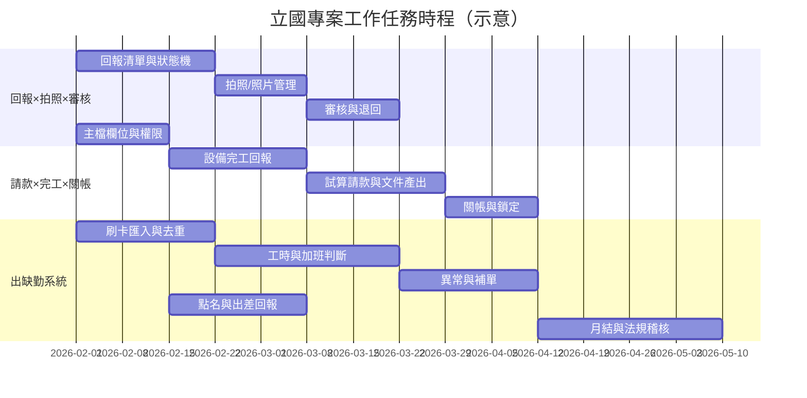

# 立國專案｜工作任務與甘特圖

- **日期：** 2026-01-30
- **用途：** 供客戶 PM 檢視各系統模組之工作任務項目與時程；可透過 MkDocs 呈現。
- **說明：** 甘特圖日期為示意，實際排程請依專案協調結果調整。吊車規劃目前暫停，不納入執行時程。

---

## 1. 模組總覽與狀態

| 系統模組 | 狀態 | 主要任務摘要 |
| -------- | ---- | ------------ |
| 回報×拍照×審核（MCR） | 進行中 | 雙軌回報、拍照分線、審核退回補件、照片歷史 |
| 請款×完工回報×關帳（MCR） | 進行中 | 設備完工回報、試算請款、文件產出、關帳鎖定 |
| 吊車作業／吊車規劃 | 暫停 | 現場主管評估暫不需要；規格與 Demo 保留 |
| 出缺勤系統 | 規劃/進行中 | 刷卡辨識、工時判斷、加班計算、異常與補單、月結與稽核 |

---

## 2. 各系統模組工作任務項目

### 2.1 回報×拍照×審核（MCR 第二階段）

| 序 | 工作任務項目 | 說明 | 產出／驗收 |
| -- | ------------ | ---- | ---------- |
| 1 | 回報清單畫面（工序層級） | 僅顯示 need_report=是；提交不因 need_photo 阻擋 | 畫面、狀態流 |
| 2 | 回報狀態機與 API | Draft→Reported→Returned→Approved；提交/退回/核定 | API、資料表 |
| 3 | 拍照／照片管理畫面 | 補拍、換圖；Current/History 版本 | 畫面、上傳 API |
| 4 | 照片狀態與儲存 | NotRequired/Pending/Completed；關聯 report_id | 資料表、API |
| 5 | 審核畫面（含退回） | 核定或退回；退回需填原因、可重新回報 | 畫面、驗證規則 |
| 6 | 主檔欄位支援 | need_report / need_photo（工序）；crane_tonnage / parking_zone_group 只讀 | 主檔、權限 |

### 2.2 請款×完工回報×關帳（MCR 第二階段）

| 序 | 工作任務項目 | 說明 | 產出／驗收 |
| -- | ------------ | ---- | ---------- |
| 1 | 設備完工回報 | 專案經理勾選完工；可重開修改（關帳前） | 畫面、API、completion_report |
| 2 | 試算請款／文件產出 | 依條件篩選產出 Excel/Word；篩選條件記錄 metadata | 畫面、POST /billing/exports |
| 3 | 請款送出與關帳 | 專案經理送出請款文件；關帳後資料鎖定 | 流程、POST /billing/close |
| 4 | 關帳狀態與鎖定 | billing_snapshot（Open/Closed）；關帳後禁止變更 | 資料表、驗證 |

### 2.3 吊車作業／吊車規劃（暫停）

| 序 | 工作任務項目 | 狀態 | 說明 |
| -- | ------------ | ---- | ---- |
| — | 停駐點效益儀表板、預定派工、進場表列印 | 暫停 | 現場主管評估暫不需要；規格與 Demo 保留，日後可恢復 |

### 2.4 出缺勤系統

| 序 | 工作任務項目 | 說明 | 產出／驗收 |
| -- | ------------ | ---- | ---------- |
| 1 | 刷卡／辨識資料匯入與去重 | 人臉／指紋辨識 Log 匯入、去重 | 匯入介面、資料表 |
| 2 | 上下班與工時判斷 | 依規則判斷出勤日、工時 | 規則引擎、狀態 |
| 3 | 加班計算（依資格） | 依勞基法參數與員工資格計算 | 參數維護、計算邏輯 |
| 4 | 異常提示與補單流程 | 每日異常通知、員工補請假／補刷卡、點名佐證 | 通知、補單畫面、流程 |
| 5 | 點名與出差回報 | 主管點名（到班／請假／未到）；業務出差回報補登 | 畫面、API、權限 |
| 6 | 月結算與法規稽核 | AB／LT／ET 寫入、法規稽核、封存供薪資 | 月結作業、稽核報告、封存 |

---

## 3. 甘特圖（示意時程）

以下時程為**示意**，實際開始日與工期請由客戶 PM 與專案協調後調整。吊車規劃已暫停，不列入圖中。

---

## 4. 圖例與備註

- **回報×拍照×審核**：與 **請款×完工×關帳** 部分任務可並行（例如主檔欄位與回報清單）。
- **出缺勤系統**：可與 MCR 第二階段並行開發，資源與優先序請由 PM 排程。
- **吊車規劃**：目前暫停，未列入甘特圖；若恢復則可依 `03_Solution/工程規格草案_MCR_第二階段.md` §7 與吊車 Demo 排入任務。
- 本頁面由 MkDocs 呈現，客戶 PM 可依此檢視並與團隊對齊實際里程碑與交付日。
