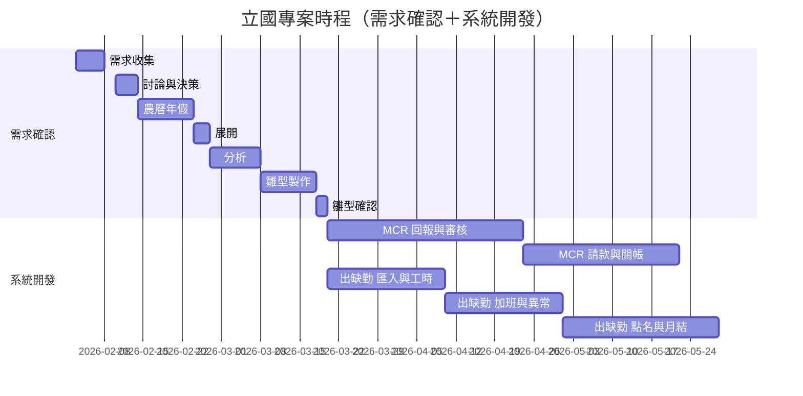

# 立國專案｜工作任務與甘特圖

- **日期：** 2026-02-26
- **用途：** 供專案經理與客戶端檢視各模組工作任務、預估工時與時程；甘特圖依工作天數推算，並標示農曆年假。
- **假設：** 2026/02/14～02/23 為台灣農曆年春節假期，不計入工作天。吊車調派暫緩，**工程請款優先實作**，吊車不納入時程。

---

## 1. 模組總覽與狀態

| 系統模組 | 狀態 | 主要任務摘要 |
| -------- | ---- | ------------ |
| 回報×拍照×審核（MCR） | 進行中 | 雙軌回報、拍照分線、審核退回補件、照片歷史 |
| 請款×完工回報×關帳（MCR） | **優先實作**，進行中 | 設備完工回報、試算請款、文件產出、關帳鎖定 |
| 吊車作業／吊車規劃 | 暫緩 | 決議暫緩；規格與 Demo 保留 |
| 出缺勤系統 | 規劃／進行中 | 刷卡辨識、工時判斷、加班計算、異常與補單、月結與稽核 |

---

## 2. 甘特圖架構說明

- **分為兩大區塊：** **需求確認**、**系統開發**。
- **需求確認：** 以每周一次會議進行討論與決策；各工作項標示預估工作天，依工作天推算時程，並排除 2026/02/14～02/23 農曆年假。
- **雛型確認後** 始進入 **系統開發**；系統開發時程依 **開發預估工時（工作天）** 推算。
- 以下各項「預估工作天」由專案經理與開發團隊填入，本文件僅依此推算甘特圖日期。

---

## 3. 需求確認階段：工作項與預估工作天

| 序 | 工作項目 | 預估工作天 | 說明 |
| -- | -------- | ---------- | ---- |
| 1 | 需求收集 | 5 | 範圍、使用者、驗收標準之整理與紀錄 |
| 2 | 討論與決策 | 5 | 每周一次會議，對齊需求、流程與介面 |
| 3 | 展開 | 3 | 需求拆解為可執行任務與規格 |
| 4 | 分析 | 7 | 流程、資料、權限與例外之分析與文件化 |
| 5 | 雛型製作 | 10 | 可操作之模擬畫面或原型 |
| 6 | 雛型確認 | 2 | 客戶端確認雛型，通過後進入系統開發 |

**合計：** 32 工作天（不含 2026/02/14～02/23 年假）。

---

## 4. 系統開發階段：工作項與預估工時

雛型確認完成後，依下列預估工作天推算開發時程；實際工時由開發團隊填入並更新。

| 序 | 工作項目 | 預估工作天 | 說明 |
| -- | -------- | ---------- | ---- |
| 1 | MCR 回報與審核 | 25 | 回報清單、狀態機、拍照／照片管理、審核與退回、主檔欄位 |
| 2 | MCR 請款與關帳 | 20 | 設備完工回報、試算請款、文件產出、關帳與鎖定 |
| 3 | 出缺勤－匯入與工時 | 15 | 刷卡／辨識匯入與去重、上下班與工時判斷 |
| 4 | 出缺勤－加班與異常 | 15 | 加班計算、異常提示與補單流程 |
| 5 | 出缺勤－點名與月結 | 20 | 點名與出差回報、月結算與法規稽核、封存 |

**合計：** 95 工作天（MCR 可與出缺勤依資源並行或依優先序排程）。

---

## 5. 甘特圖（依工作天推算；2/14～2/23 年假標示）

需求確認採**工作天推算**並避開 2026/02/14～02/23；系統開發自雛型確認完成日後以**預估工時**接續排程。

**備註：**

- **需求確認**：討論與決策以每周一次會議進行；2/10～2/13 為年假前之會議與準備，2/14～2/23 不排工作。
- **分析**：2/27 起算 7 工作天，圖中以 9 日曆天表示（含週末）。
- **系統開發**：圖中天數為依預估工作天換算之日曆天（約 1 工作天＝1.4 日曆天），實際以專案預估工時表為準。MCR 與出缺勤可依資源規劃並行或順序執行。

---

## 6. 各系統模組工作任務項目（對照用）

### 6.1 回報×拍照×審核（MCR 第二階段）

| 序 | 工作任務項目 | 說明 | 產出／驗收 |
| -- | ------------ | ---- | ---------- |
| 1 | 回報清單畫面（工序層級） | 僅顯示需回報工序；提交不因照片阻擋 | 畫面、狀態流 |
| 2 | 回報狀態與 API | 提交／退回／核定流程與介面 | API、資料表 |
| 3 | 拍照／照片管理畫面 | 補拍、換圖；現行版／歷史版 | 畫面、上傳 API |
| 4 | 照片狀態與儲存 | 不需／待補／已完成；關聯回報 | 資料表、API |
| 5 | 審核畫面（含退回） | 核定或退回；退回須填原因、可再送審 | 畫面、驗證規則 |
| 6 | 主檔欄位支援 | 工序需回報／需拍照；吊車欄位唯讀 | 主檔、權限 |

### 6.2 請款×完工回報×關帳（MCR 第二階段）

| 序 | 工作任務項目 | 說明 | 產出／驗收 |
| -- | ------------ | ---- | ---------- |
| 1 | 設備完工回報 | 專案經理勾選完工；關帳前可重開修改 | 畫面、API |
| 2 | 試算請款／文件產出 | 依條件篩選產出；篩選條件紀錄 | 畫面、匯出 API |
| 3 | 請款送出與關帳 | 專案經理送出請款；關帳後資料鎖定 | 流程、關帳 API |
| 4 | 關帳狀態與鎖定 | 關帳後禁止變更 | 資料表、驗證 |

### 6.3 吊車作業／吊車規劃（暫停）

| 序 | 工作任務項目 | 狀態 | 說明 |
| -- | ------------ | ---- | ---- |
| — | 停駐點效益儀表板、預定派工、進場表列印 | 暫停 | 現場主管評估暫不需要；規格與 Demo 保留 |

### 6.4 出缺勤系統

| 序 | 工作任務項目 | 說明 | 產出／驗收 |
| -- | ------------ | ---- | ---------- |
| 1 | 刷卡／辨識匯入與去重 | 辨識 Log 匯入與去重 | 匯入介面、資料表 |
| 2 | 上下班與工時判斷 | 依規則判斷出勤與工時 | 規則、狀態 |
| 3 | 加班計算（依資格） | 依勞基法參數與員工資格 | 參數、計算邏輯 |
| 4 | 異常提示與補單流程 | 異常通知、補請假／補刷卡、點名佐證 | 通知、補單畫面 |
| 5 | 點名與出差回報 | 主管點名；業務出差回報補登 | 畫面、API、權限 |
| 6 | 月結算與法規稽核 | 月結、法規稽核、封存供薪資 | 月結作業、稽核、封存 |

---

## 7. 圖例與更新方式

- **需求確認**：每周一次會議；工作天數與日期由專案經理依實際會議與產出更新。
- **系統開發**：預估工作天由開發團隊填入，甘特圖依此推算；若並行或順序調整，由 PM 更新本文件。
- **吊車規劃**：目前暫停，未列入甘特圖；若恢復則另案排入需求確認與開發時程。
