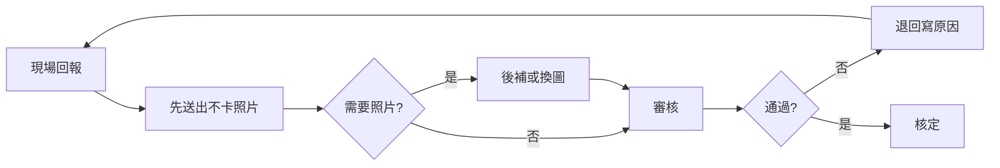

# 立國專案管理服務｜總覽

- **文件性質：** 專案管理文件（給客戶與專案團隊檢視，不含技術規格）
- **維護：** 矽聯科技專案管理與立國專案團隊共同維護
- **更新日：** 2026-01-30

---

## 一、專案緣由與目標

### 1.1 專案緣由

立國集團長期深耕熱交換器與設備檢維修服務。現場回報、請款文件與出缺勤管理分散於不同作業方式，衍生下列課題：

- 回報流程受「須同步完成拍照」所阻，現場無法先行完成回報
- 審核往返成本高，補件與退回流程缺乏明確規範
- 請款與文件產出仰賴人工對應，易生遺漏或錯誤
- 出缺勤與工時、加班、法規稽核期望整合為單一可稽核流程，降低月底爭議

本 e 化專案之目的，在於將「回報 → 審核 → 請款 → 關帳」與「出缺勤」建置為可追溯、可鎖定、可說明之數位流程，以提升現場回報效率、主管決策依據與請款／法規合規性。

### 1.2 專案目標

| 目標 | 說明 |
| ---- | ---- |
| 回報不卡關 | 現場得先完成回報，照片得後補；回報提交不以照片完成為前提 |
| 審核有彈性 | 審核得退回補件並填寫原因，補件後得重新送審，無須從頭填報 |
| 請款有依據 | 請款與文件產出以回報資料為準，關帳後不得變更，可追溯 |
| 出缺勤可稽核 | 自刷卡／辨識至工時／加班、異常／補單、月結／法規稽核，迄封存供薪資使用，全程可稽核 |
| 長期有知識 | 除系統上線外，共同建立石化維護管理之產業知識與 AI 應用能力 |

---

## 二、主要角色與分工

本專案由**矽聯科技**與**立國**兩邊團隊協作，角色如下。

| 角色 | 所屬 | 主要負責 | 備註 |
| ---- | ---- | -------- | ---- |
| **顧問暨 PM** | 矽聯科技 | 需求對齊、時程與範圍管理、決策紀錄、與客戶端窗口協調 | 專案總協調 |
| **開發團隊** | 矽聯科技 | 系統分析、設計、開發、部署、測試與上線支援 | 依 PM 排程交付 |
| **專案負責人** | 立國 | 需求確認、決策拍板、驗收與上線同意 | 客戶端窗口 |
| **專案團隊** | 立國 | 日常需求提供、流程確認、測試與教育訓練參與；並逐步學習用 AI 做知識管理 | 與矽聯 PM／開發對接 |

**協作方式：** 需求與待決事項由矽聯顧問暨 PM 與立國專案負責人／專案團隊對齊，決策後列入「待決議事項」追蹤；開發由矽聯依排程執行，立國參與測試與驗收。

---

## 三、規劃模組總覽

專案規劃模組如下；本節不涉及技術規格，僅說明範圍、用途與目前狀態。

| 模組 | 說明 | 目前狀態 |
| ---- | ---- | -------- |
| **MCR 回報與審核** | 現場回報進度、拍照可後補、審核可退回補件，流程可追溯 | 進行中 |
| **MCR 請款與關帳** | 設備完工回報、試算請款、文件產出、關帳後鎖定 | 進行中 |
| **吊車作業／吊車規劃** | 停駐點效益看板、預定派工、進場表（現場主管評估暫不需要） | **暫停**，規格與 Demo 保留 |
| **出缺勤系統** | 刷卡／辨識匯入、工時與加班判斷、異常與補單、點名與出差、月結與法規稽核 | 規劃／進行中 |
| **AI 與知識管理服務** | 訓練專案團員運用 AI 進行知識管理與應用，建立石化維護管理產業知識 | 長期服務項目 |

---

## 四、程式清單（交付項目）

本節「程式清單」指交付予客戶端之**功能與文件項目**，非開發用技術清單。

### 4.1 已交付（第一階段）

| 項目 | 說明 | 給誰用 |
| ---- | ---- | ------ |
| **操作手冊與 SOP** | 第一階段 MCR 操作手冊（廠區／設備／型號工序／合約／案件設備／現場回報／審核／報表等）與建議 SOP，已發布於本網站 | 現場、主管、專案經理、專案團隊 |

→ **[操作手冊與 SOP](操作手冊與SOP.md)**（獨立頁面，已完成的系統操作手冊與 SOP 發布於此）

### 4.2 規劃中／進行中（第二階段與出缺勤）

| 項目 | 說明 | 給誰用 |
| ---- | ---- | ------ |
| **回報與審核功能** | 回報先送、照片後補、審核可退回並寫原因、補件後再送 | 現場、監工／主管 |
| **請款與關帳功能** | 設備完工回報、試算請款、文件產出、關帳後鎖定 | 專案經理、請款人員 |
| **出缺勤功能** | 刷卡／辨識、工時與加班、異常與補單、點名與出差、月結與法規稽核、封存 | 員工、主管、HR |
| **專案管理文件（本網站）** | 緣由、模組、任務、流程圖、待決議、甘特圖 | 專案負責人、專案團隊、矽聯 PM |

### 4.3 暫停（保留日後使用）

| 項目 | 說明 |
| ---- | ---- |
| **吊車儀表板與派工** | 現場主管評估暫不需要，規劃暫停；Demo 與規格保留，日後若需要可再啟動 |

---

## 五、第一階段已完成：操作手冊與建議 SOP

第一階段已上線之 MCR 功能，已整理為**標準版操作手冊**與**建議 SOP**，供對外培訓與內部交接使用。

### 5.1 操作手冊涵蓋範圍

- **基礎資料：** 廠區、設備、型號工序、合約、案件與設備之建檔與查詢
- **現場與審核：** 現場回報、審核通過／退回、進度追蹤、報表
- **共通規則：** 登入與權限、查詢／清單／明細之使用方式、常見錯誤與注意事項（含即時回報、照片須可辨識設備、非標準工序須由管理者先行建檔）

### 5.2 建議 SOP 重點

- 回報前須確認案件、廠區、設備、工序已建檔
- 以即時回報為原則，避免集中補報衍生爭議
- 照片須可辨識設備與成果；審核退回常見原因：照片不清、角度不符、回報工序錯誤
- 非標準工序須依治理規範由管理者新增後始得回報

第一階段操作手冊與建議 SOP 之完整內容已發布於本網站 **[操作手冊與 SOP](操作手冊與SOP.md)** 頁面。

---

## 六、各模組目標與流程概略

各模組目標與流程概略如下，並以流程圖輔助說明。

### 6.1 MCR 回報與審核（第二階段）

**目標：** 現場得先完成回報提交，不以照片完成為前提；需照片之案件得後補或換圖；審核得退回並填寫原因，補件後得重新送審。

**流程概略：**

### 6.2 MCR 請款與關帳

**目標：** 專案經理得進行設備完工勾選、試算請款、產出文件；送出請款後執行關帳，關帳後資料鎖定不得變更。

**流程概略：**

### 6.3 出缺勤系統

**目標：** 刷卡／辨識資料匯入後，由系統進行上下班與工時、加班之判斷；異常時發出提示，員工得補請假或補刷卡；主管得進行點名、月結，經法規稽核後封存供薪資使用。

**流程概略：**

---

## 七、工作任務與狀態（開發階段對照）

任務狀態對應**軟體開發主要程序**，供專案經理與客戶端對齊進度。

### 7.1 開發階段說明（十一階段）

| 階段 | 說明 |
| ---- | ---- |
| **需求收集** | 界定範圍、使用者與驗收標準，並紀錄 |
| **討論** | 雙方就需求、流程、介面或規則進行對齊與澄清 |
| **決策** | 由負責人（客戶端專案負責人、矽聯 PM）拍板選項，並紀錄於待決議事項 |
| **展開** | 將需求拆解為可執行任務與規格，納入計畫 |
| **分析** | 完成流程、資料、權限與例外之分析並產出可開發說明 |
| **雛形** | 產出可操作之模擬畫面或原型（尚未接正式後端） |
| **開發** | 依規格實作功能與畫面，產出可測版本 |
| **部署** | 將系統部署至測試或正式環境 |
| **測試** | 依情境與案例驗證，缺陷修正後再驗 |
| **上線** | 正式開放使用者使用，並完成備援與監控 |
| **驗收** | 客戶端確認範圍與品質達標，專案階段結案或進入維運 |

### 7.2 各模組任務與狀態對照（概要）

細部任務與日期以專案甘特圖與會議紀錄為準。

| 模組 | 主要任務 | 目前對應階段 |
| ---- | -------- | ------------ |
| MCR 回報與審核 | 回報先送、照片後補；審核可退回填原因、補件再送 | 展開～開發 |
| MCR 請款與關帳 | 設備完工回報、試算請款、文件產出、關帳鎖定 | 展開～開發 |
| 出缺勤 | 刷卡匯入、工時與加班、異常與補單、點名與出差、月結與稽核 | 需求收集～分析 |
| 吊車規劃 | 暫停；若恢復則自需求收集重新對齊 | 暫停 |
| AI 與知識管理 | 訓練專案團隊運用 AI、建立產業知識 | 需求收集～討論 |

任務狀態由專案經理於專案會議或甘特圖中更新。詳細任務與甘特圖見 **[工作任務與甘特圖](立國專案_工作任務與甘特圖.md)**。

---

## 八、待決議事項

專案進行中須經**雙方決策**之事項，另於獨立頁面紀錄與管理；決議後註記結果與**決議日期**。

→ **[待決議事項](待決議事項.md)**（獨立紀錄與決議日期管理）

---

## 九、長期 e 化與 AI 知識管理服務

除了把系統建好、上線、驗收，矽聯科技在本專案中還扮演**長期 e 化與知識夥伴**的角色。

### 9.1 協助 e 化專案進行

- 需求對齊、範圍與時程管理、決策紀錄
- 系統分析、設計、開發、部署、測試與上線支援
- 操作手冊、建議 SOP、專案管理文件（如本網站）的整理與維護

### 9.2 協助訓練專案團員：AI 與知識管理

- **目的：** 使專案團隊除使用系統外，能運用 **AI 進行知識管理與應用**，將現場與維修經驗沉澱為可重用知識。
- **方向：**  
  - 運用 AI 工具整理文件、問答與流程說明  
  - 將維護作業、判斷邏輯與回報方式轉為可查詢、可教學之內容  
  - 逐步建立**石化產業維護管理**之產業知識庫，支援新人訓練、SOP 優化與對外服務

### 9.3 預期成果

- 專案團隊得**以 AI 自行維護與擴充**專案知識與文件。
- 維修與回報之**經驗與規則**得以沉澱留存，降低僅依賴個人經驗之風險。
- 長期形成**石化維護管理**之產業知識基礎，支援培訓、合規與服務升級。

訓練時程與形式將與客戶端專案負責人及專案團隊討論後，排入「待決議事項」與專案計畫。

---

## 十、文件與連結整理

| 文件／連結 | 說明 |
| ---------- | ---- |
| **本頁（專案管理服務總覽）** | 緣由、角色、模組、程式清單、第一階段完成、流程圖、任務狀態、長期服務 |
| **[工作任務與甘特圖](立國專案_工作任務與甘特圖.md)** | 各模組任務細項與甘特圖，供 PM 與客戶對齊時程 |
| **[操作手冊與 SOP](操作手冊與SOP.md)** | 已完成的系統之操作手冊與建議 SOP，獨立發布於此 |
| **[待決議事項](待決議事項.md)** | 待決議項目與決議紀錄（含決議日期）之獨立管理頁面 |

本網站為**專案管理與客戶檢視用**，不放置技術規格與程式碼；技術文件由專案團隊另行維護。
