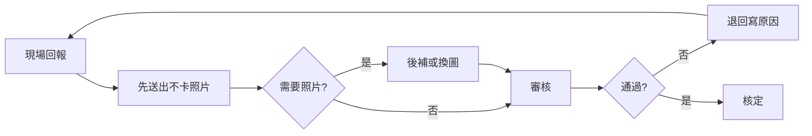

# 立國專案管理服務｜總覽

- **文件性質：** 專案管理文件（給客戶與專案團隊檢視，不含技術規格）
- **維護：** 矽聯科技專案管理與立國專案團隊共同維護
- **更新日：** 2026-01-30

---

## 一、專案緣由與目標

### 1.1 為什麼要做這次 e 化

立國集團長期深耕熱交換器與設備檢維修服務，現場回報、請款文件與出缺勤管理分散在不同作業方式，造成：

- 回報常被「等照片」卡住，現場想先報也報不出去
- 審核往返成本高，補件與退回流程不夠清楚
- 請款與文件產出要人工對來對去，容易漏或錯
- 出缺勤與工時、加班、法規稽核希望一次到位，減少月底爭議

這次 e 化專案的目的，就是**把「回報 → 審核 → 請款 → 關帳」與「出缺勤」做成可追溯、可鎖定、可說清楚的數位流程**，讓現場做得輕、主管看得準、請款與法規都站得住腳。

### 1.2 我們想達成的目標（白話版）

| 目標 | 白話說明 |
| ---- | --------- |
| 回報不卡關 | 現場可以先完成回報，照片可以後補，不用為了等拍照而拖整天 |
| 審核有彈性 | 審核可以退回補件、寫原因，現場補好再送，不用重頭來 |
| 請款有依據 | 請款與文件都依回報資料產出，關帳後不能亂改，可追溯 |
| 出缺勤可稽核 | 刷卡／辨識 → 工時／加班 → 異常／補單 → 月結／法規稽核，一路到封存給薪資用 |
| 長期有知識 | 不只上線系統，還要一起建立「石化維護管理」的產業知識與 AI 應用能力 |

---

## 二、主要角色與分工

本專案由**矽聯科技**與**立國**兩邊團隊協作，角色如下。

| 角色 | 所屬 | 主要負責 | 聯絡／備註 |
| ---- | ---- | -------- | ---------- |
| **邱勤文** | 矽聯科技 | **顧問 ＋ 專案經理（PM）**：需求對齊、時程與範圍管理、決策紀錄、與立國窗口協調 | 專案總協調 |
| **開發團隊** | 矽聯科技 | 系統分析、設計、開發、部署、測試與上線支援 | 依 PM 排程交付 |
| **Fion 副總** | 立國 | **立國端專案負責人**：需求確認、決策拍板、驗收與上線同意 | 立國窗口 |
| **立國專案團隊** | 立國 | 日常需求提供、流程確認、測試與教育訓練參與；並逐步學習用 AI 做知識管理 | 與矽聯 PM／開發對接 |

**協作方式：** 需求與待決事項由邱勤文（PM）與 Fion 副總／立國專案團隊對齊，決策後列入「待決議事項」追蹤；開發由矽聯依排程執行，立國參與測試與驗收。

---

## 三、規劃模組總覽

目前專案分成以下幾大塊，**不含技術文件**，只談「做什麼、給誰用、現在到哪一階段」。

| 模組 | 一句話說明 | 目前狀態 |
| ---- | ----------- | -------- |
| **MCR 回報與審核** | 現場回報進度、拍照可後補、審核可退回補件，流程清楚可追溯 | 進行中 |
| **MCR 請款與關帳** | 設備完工回報、試算請款、文件產出、關帳後鎖定不給改 | 進行中 |
| **吊車作業／吊車規劃** | 停駐點效益看板、預定派工、進場表（現場主管評估暫不需要） | **暫停**，規格與 Demo 保留 |
| **出缺勤系統** | 刷卡／辨識匯入、工時與加班判斷、異常與補單、點名與出差、月結與法規稽核 | 規劃／進行中 |
| **AI 與知識管理服務** | 協助訓練立國專案團員用 AI 做知識管理與應用，建立石化維護管理產業知識 | 長期服務項目 |

---

## 四、程式清單（交付給客戶的項目）

這裡的「程式清單」指的是**會交到立國手上的功能與文件**，不是開發用技術清單。

### 4.1 已交付（第一階段）

| 項目 | 說明 | 給誰用 |
| ---- | ---- | ------ |
| **第一階段操作手冊（MCR 標準版）** | 廠區／設備／型號工序／合約／案件設備／現場回報／審核／進度追蹤／報表等操作步驟與注意事項 | 立國現場、主管、專案經理 |
| **建議 SOP（操作手冊內含）** | 共通前置條件、查詢／清單／明細／按鈕結構、常見錯誤與注意事項、即時回報與照片規範 | 立國專案團隊、訓練用 |

### 4.2 規劃中／進行中（第二階段與出缺勤）

| 項目 | 說明 | 給誰用 |
| ---- | ---- | ------ |
| **回報與審核功能** | 回報先送、照片後補、審核可退回並寫原因、補件後再送 | 現場、監工／主管 |
| **請款與關帳功能** | 設備完工回報、試算請款、文件產出、關帳後鎖定 | 專案經理、請款人員 |
| **出缺勤功能** | 刷卡／辨識、工時與加班、異常與補單、點名與出差、月結與法規稽核、封存 | 員工、主管、HR |
| **專案管理文件（本網站）** | 緣由、模組、任務、流程圖、待決議、甘特圖 | Fion 副總、立國專案團隊、PM |

### 4.3 暫停（保留日後使用）

| 項目 | 說明 |
| ---- | ---- |
| **吊車儀表板與派工** | 現場主管評估暫不需要，規劃暫停；Demo 與規格保留，日後若需要可再啟動 |

---

## 五、第一階段已完成：操作手冊與建議 SOP

第一階段已上線的 MCR 功能，我們已整理成**標準版操作手冊**與**建議 SOP**，方便立國對外培訓與內部交接。

### 5.1 操作手冊涵蓋範圍（白話）

- **基礎資料：** 廠區、設備、型號工序、合約、案件與設備的建檔與查詢
- **現場與審核：** 現場回報、審核通過／退回、進度追蹤、報表
- **共通規則：** 登入與權限、查詢／清單／明細怎麼用、常見錯誤與注意事項（例如：即時回報、照片要能辨識設備、非標準工序要由管理者先建）

### 5.2 建議 SOP 重點（白話）

- 回報前先確認案件／廠區／設備／工序是否建好
- 以「即時回報」為原則，避免集中補報造成爭議
- 照片要能辨識設備與成果，審核退回常見原因：照片不清、角度不符、回報工序錯誤
- 非標準工序須依治理規範由管理者新增後再回報

第一階段操作手冊與建議 SOP 的完整內容，由矽聯提供檔案或連結給立國專案團隊，不放在技術文件庫。

---

## 六、各模組目標與大概流程圖

用**白話**說明各塊「要達成什麼」，並用簡單流程圖呈現「大概怎麼跑」。

### 6.1 MCR 回報與審核（第二階段）

**目標（白話）：** 現場可以先把「做完了」報出去，不用等照片；需要照片的案子再後補或換圖；審核可以退回並寫原因，現場補好再送。

**大概流程：**

### 6.2 MCR 請款與關帳

**目標（白話）：** 專案經理可以勾選「設備完工」、試算請款、產出文件；送出請款後關帳，關帳後資料鎖定不能再改。

**大概流程：**

### 6.3 出缺勤系統

**目標（白話）：** 刷卡／辨識資料進來後，系統幫忙算上下班與工時、加班；有異常就提醒，員工可以補請假或補刷卡；主管可以點名、月結，最後法規稽核完封存給薪資用。

**大概流程：**

---

## 七、工作任務與狀態（白話＋開發階段對照）

任務說明用**大家都能懂的方式**寫；狀態則對應**軟體開發主要程序**，方便 PM 與客戶對齊「現在卡在哪一關」。

### 7.1 開發階段說明（十一關）

| 階段 | 白話說明 |
| ---- | --------- |
| **需求收集** | 把「要做什麼、誰要用、做到什麼程度」先講清楚、記下來 |
| **討論** | 兩邊一起對需求、流程、畫面或規則，有疑問就提出來 |
| **決策** | 有選項時由負責人拍板（例如立國 Fion、矽聯 PM），並記在待決議 |
| **展開** | 把需求拆成可執行的任務與規格，排進計畫 |
| **分析** | 把流程、資料、權限、例外狀況分析清楚，寫成可開發的說明 |
| **雛形** | 先做一版可操作的 mock 或原型，讓大家看得到、摸得到 |
| **開發** | 依規格實作功能與畫面，完成一版可測的系統 |
| **部署** | 把系統放到測試或正式環境，讓大家能連上去用 |
| **測試** | 依情境與案例驗證，抓錯、修錯、再驗 |
| **上線** | 正式開放給使用者，並做好備援與監控 |
| **驗收** | 客戶確認範圍與品質達標，專案階段結案或進入維運 |

### 7.2 各模組任務與狀態對照（概要）

以下為**概要對照**，細部任務與日期以專案甘特圖與會議紀錄為準。

| 模組 | 主要任務（白話） | 目前對應階段 |
| ---- | ----------------- | ------------ |
| MCR 回報與審核 | 把「回報可先送、照片後補」做成功能；審核可退回寫原因、補件再送 | 展開～開發 |
| MCR 請款與關帳 | 設備完工回報、試算請款、文件產出、關帳鎖定 | 展開～開發 |
| 出缺勤 | 刷卡匯入、工時與加班、異常與補單、點名與出差、月結與稽核 | 需求收集～分析 |
| 吊車規劃 | 暫停；日後若恢復則從需求收集重新對齊 | 暫停 |
| AI 與知識管理 | 訓練立國團隊用 AI、建立產業知識 | 需求收集～討論 |

實際每項任務的「狀態」會落在上述十一關之一，由 PM 在專案會議或甘特圖中更新。詳細任務列表與甘特圖見 **[工作任務與甘特圖](立國專案_工作任務與甘特圖.md)**。

---

## 八、待決議事項

專案進行中需要**立國與矽聯一起拍板**的事項，會列在這裡，決策後註記結果與日期。

| 序 | 待決議內容（白話） | 選項／備註 | 狀態 |
| -- | ------------------- | ---------- | ---- |
| 1 | 第二階段 MCR 各功能上線順序與優先級 | 回報／審核先上，還是與請款一起排？ | 待討論 |
| 2 | 出缺勤系統上線時程與範圍（是否分階段） | 例如：先刷卡與工時，再加班與月結？ | 待討論 |
| 3 | 吊車規劃是否於某時點重啟 | 目前暫停；若現場需求改變可再排入 | 暫停中 |
| 4 | AI 與知識管理訓練的頻率與形式 | 工作坊、一對一、教材交付等 | 待討論 |

**更新方式：** 會議中決策後，由 PM 更新本表（註記「已決：……」與日期），必要時同步到會議紀錄。

---

## 九、長期 e 化與 AI 知識管理服務

除了把系統建好、上線、驗收，矽聯科技在本專案中還扮演**長期 e 化與知識夥伴**的角色。

### 9.1 協助 e 化專案進行

- 需求對齊、範圍與時程管理、決策紀錄
- 系統分析、設計、開發、部署、測試與上線支援
- 操作手冊、建議 SOP、專案管理文件（如本網站）的整理與維護

### 9.2 協助訓練立國專案團員：AI 與知識管理

- **目的：** 讓立國專案團隊不只「用系統」，還能用 **AI 做知識管理與應用**，把現場與維修經驗沉澱成可重用的知識。
- **方向（白話）：**  
  - 怎麼用 AI 工具整理文件、問答、流程說明  
  - 怎麼把「我們怎麼做維護、怎麼判斷、怎麼報」變成可查、可教的內容  
  - 逐步建立**石化產業維護管理**的產業知識庫，方便日後新人訓練、SOP 優化、甚至對外服務

### 9.3 預期成果（白話）

- 立國專案團隊能**自己用 AI 維護與擴充**專案知識與文件。
- 維修與回報的**經驗與規則**有地方沉澱，不只存在個人腦袋裡。
- 長期可形成**石化維護管理**的產業知識基礎，支援培訓、合規與服務升級。

具體訓練時程與形式，將與 Fion 副總及立國專案團隊討論後排入「待決議事項」與專案計畫。

---

## 十、文件與連結整理

| 文件／連結 | 說明 |
| ---------- | ---- |
| **本頁（專案管理服務總覽）** | 緣由、角色、模組、程式清單、第一階段完成、流程圖、任務狀態、待決議、長期服務 |
| **[工作任務與甘特圖](立國專案_工作任務與甘特圖.md)** | 各模組任務細項與示意甘特圖，供 PM 與客戶對齊時程 |
| **第一階段操作手冊（MCR 標準版）** | 由矽聯提供檔案或連結給立國，不放在技術庫 |

本網站（MkDocs）為**專案管理與客戶檢視用**，不放置技術規格與程式碼；技術文件由專案團隊另行維護。
